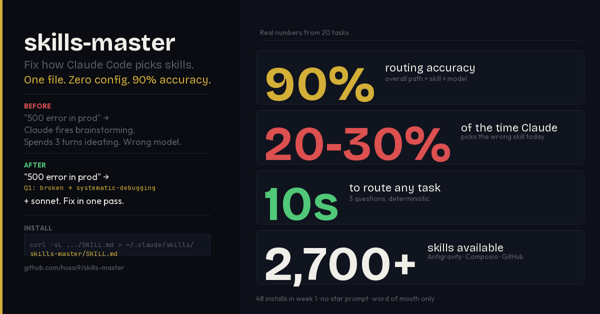

# skill-router



**Agent routing and orchestration for individual builders and power users.**

> Today the repo is Claude Code-first. The core product direction is broader:
> help an individual operator choose the right capability, lane, and workflow
> faster. It is not an enterprise governance product.

> If this saves you time, a ⭐ on GitHub helps others find it.

Claude Code has access to hundreds of skills — but it picks the wrong one 20-30% of the time. It rationalizes skipping skills entirely. It burns `opus` tokens on tasks that need `haiku`. It fires `brainstorming` when you just need `systematic-debugging`.

`skill-router` fixes this with a 3-question routing engine that runs before every non-trivial task and always outputs the right **Skill + Agent + Model**.

---

## Positioning

- **Best for:** individual developers, solo builders, power users, heavy skill users
- **Core promise:** route to the right capability faster and reduce workflow thrash
- **Not for:** org governance, policy enforcement, audit, or enterprise safety controls
- **Separate from Sentigent:** Sentigent governs and proves agent judgment for teams and enterprises; `skill-router` optimizes execution flow for individual operators

## Two flavors — Claude Code + Codex

`skill-router` ships in two adapted forms. Same routing engine, same dispatch
triple, different host harnesses.

| Flavor | Where it lives | Loaded as | Status |
|--------|----------------|-----------|--------|
| **Claude Code** | [`SKILL.md`](./SKILL.md) | Auto-loaded skill at `~/.claude/skills/skill-router/SKILL.md` | Production |
| **Codex** | [`codex-skill/skill-router/`](./codex-skill/skill-router/) | Manual invocation via `AGENTS.md` template | Working draft |

Codex groundwork:
- [`CODEX_ADAPTATION_PLAN.md`](./CODEX_ADAPTATION_PLAN.md) — what changes between harnesses
- [`IMPLEMENTATION_PLAN.md`](./IMPLEMENTATION_PLAN.md), [`PRODUCT_POSITIONING.md`](./PRODUCT_POSITIONING.md), [`ROUTING_CONTRACT.md`](./ROUTING_CONTRACT.md) — design
- [`templates/AGENTS.codex.template.md`](./templates/AGENTS.codex.template.md) — drop-in template for Codex repos
- `python3 scripts/scan_codex_inventory.py` — inventory tool

---

## Before / After

**You type:** *"The login endpoint is returning 500 errors in production"*

**Without skill-router:**
Claude launches `brainstorming`, spends time ideating on architecture, eventually reads the error. Uses `opus` the whole time.

**With skill-router:**
Q1 fires: something is broken → `systematic-debugging` + `sonnet`. Reads the error, traces the stack, applies the fix. Right skill, right model, first time.

## Measured Results

Tested via `claude -p` CLI on 20 real-world task prompts:

| Dimension | Score |
|-----------|-------|
| Overall (path + skill + model) | 18/20 **(90%)** |
| Path routing | 19/20 (95%) |
| Skill selection | 19/20 (95%) |
| Model selection | 19/20 (95%) |
| Skill tool actually fires correctly | 7/8 **(88%)** |

The 2 routing misses share one root cause: auth-adjacent task wording incorrectly triggering the "auth → opus" escalation rule. Fixable with a tighter signal.

> The top four rows come from `run_routing_test.sh` (20 prompts through `claude -p`). The invocation row (7/8) is from a separate live-session test verifying the `Skill` tool actually fires, not just that the routing triple is correct.

Test harness is in the repo — run `bash run_routing_test.sh` against your own setup.

---

## Proof in the Wild — Multi-Domain Chaining

Two unedited screenshots from real Claude Code sessions showing the router announcing a chain *before* touching code.

**Multi-domain BUILD → 4-skill chain:**

> "lets start teh implementation"
> → *This touches 3 domains: UI/Frontend, DB schema, and a new Edge function.
>   Chain: `writing-plans` → `superpowers:dispatching-parallel-agents` → `frontend-design` + `db-expert`.*


**Single-domain OPERATE → no chain, just the right skill:**

> "please revewi the entier system again ... code reveiw"
> → *This is an OPERATE task → `superpowers:requesting-code-review` → `superpowers:code-reviewer` agent.*


Same router, same install. The first announces a 4-step chain across UI + DB + Edge. The second picks one skill and one agent and gets to work. That's the routing table in `SKILL.md` doing exactly what it says.

Full breakdown: [`assets/proof/README.md`](assets/proof/README.md).

---

## How It Works

Three questions. Always in this order.

```
Q1: Is something BROKEN / WRONG / FAILING?
    → systematic-debugging

Q2: Is this CREATE / BUILD / ADD something new?
    → brainstorming → writing-plans → domain skill

Q3: Everything else (improve, ship, configure, automate, research)?
    → operate path

AMBIGUOUS? → default to the higher-complexity path
```

Every route outputs a **dispatch triple:**

```
Skill:  superpowers:systematic-debugging
Agent:  general-purpose
Model:  sonnet
```

Model selection is part of routing — not a separate decision. Simple file reads get `haiku`. Complex multi-file debugging gets `opus`. Everything else gets `sonnet`.

---

## Install

### 1. Install the skill (required)

```bash
mkdir -p ~/.claude/skills/skill-router
curl -sL https://raw.githubusercontent.com/hussi9/skill-router/main/SKILL.md \
  > ~/.claude/skills/skill-router/SKILL.md
```

Claude Code loads it automatically. You never invoke it manually — it runs before every non-trivial task.

### 2. Add personal overrides (optional)

```bash
curl -sL https://raw.githubusercontent.com/hussi9/skill-router/main/SKILL.personal.md \
  > ~/.claude/skills/skill-router/SKILL.personal.md
```

Edit it to add project-specific routing. The core runs first, your overrides layer on top (CSS cascade model).

### 3. Status bar with active skill indicator (optional)

See which skill is active directly in your Claude Code status line:

```
◆ sonnet · ~/myproject · ⎇ main · ⚙ systematic-debugging · ▓▓░░░░░░░░ 20% · $0.03
```

**Install the statusline:**

```bash
curl -sL https://raw.githubusercontent.com/hussi9/skill-router/main/statusline.sh \
  > ~/.claude/statusline.sh
chmod +x ~/.claude/statusline.sh
```

**Add to `~/.claude/settings.json`** (merge with your existing hooks):

```json
{
  "hooks": {
    "PostToolUse": [
      {
        "matcher": "Skill",
        "hooks": [
          {
            "type": "command",
            "command": "skill=$(echo \"$CLAUDE_TOOL_INPUT\" | jq -r '.skill // empty'); if [[ -n \"$skill\" ]]; then printf '%s\\t%s\\n' \"$(date '+%Y-%m-%d %H:%M:%S')\" \"$skill\" >> ~/.claude/skill_usage.log; fi",
            "async": true
          }
        ]
      }
    ]
  },
  "statusLine": {
    "type": "command",
    "command": "~/.claude/statusline.sh",
    "padding": 2
  }
}
```

The full hook snippet is in `settings-hooks.json` in this repo.

**What each segment means:**

| Segment | Meaning |
|---------|---------|
| `◆` / `◈` / `◉` / `⚡` | mood — context fill / cost level |
| `sonnet` | active model |
| `~/myproject` | working directory |
| `⎇ main✱3` | git branch + dirty file count |
| `⚙ systematic-debugging` | last skill invoked (shown 120s) |
| `▓▓░░░░░░░░ 20%` | context window fill |
| `4t` | turn count |
| `$0.03` | session cost |
| `1:42` | session duration |
| `+47 −12` | lines added / removed |

**View your skill usage log:**

```bash
# All skills used
cat ~/.claude/skill_usage.log

# Most used skills
sort ~/.claude/skill_usage.log | uniq -c -f1 | sort -rn

# skill-router invocations only
grep skill-router ~/.claude/skill_usage.log | wc -l
```

---

## What Gets Routed

| Path | Examples | Routing |
|------|----------|---------|
| **BROKEN** | error, crash, test fail, wrong output | `systematic-debugging` → sonnet |
| **BUILD** | new feature, component, integration | `brainstorming` → `writing-plans` → domain skill |
| **OPERATE** | refactor, deploy, configure, research | specific skill per signal |
| **Production incident** | 500 errors in prod, data loss | `systematic-debugging` → **opus** |
| **Multi-domain** | fix + add tests + deploy | announces chain, runs each skill in order |

Full routing table is in [SKILL.md](./SKILL.md).

---

## Works With 2,700+ Skills

- **Superpowers** — process discipline skills (`brainstorming`, `systematic-debugging`, `verification-before-completion`, etc.)
- **Antigravity** — 1,400+ domain skills (`react-patterns`, `typescript-expert`, `seo-audit`, `langgraph`, etc.)
- **Composio** — 940+ SaaS integrations (`stripe-automation`, `slack-automation`, etc.)
- **Community** — any GitHub repo with a `SKILL.md` (auto-discovered and installed)

---

## Skill Discovery — The Key Differentiator

New skills are published to GitHub daily. skill-router keeps you current without manual tracking.

**How it works — on every non-trivial task:**

```
1. Route via the 3-question triage (BROKEN / BUILD / OPERATE)
2. Check local catalog for a more specific match:
   ls ~/.agent/skills/ | grep -iE '<keyword>'        ← 1,400+ Antigravity skills
   ls ~/.composio-skills/ | grep -iE '<keyword>'     ← 940+ Composio integrations
   ls ~/.claude/skills/ | grep -iE '<keyword>'       ← your custom skills
3. If a better/more specific skill exists → use it instead
4. If no local match → search GitHub for "SKILL.md" claude <keyword>
5. Auto-clone and install the matching skill
6. Invoke it immediately
```

**Example:** You ask "help me optimize my Kubernetes pod scheduling."
- Table routes to `system-design` (generic)
- Catalog check finds `kubernetes-expert` in Antigravity
- skill-router uses `kubernetes-expert` instead
- You get specialist-level guidance without knowing the skill existed

The catalog check is the reason people install this once and keep it — new skills become available without any manual tracking.

---

## Personal Overrides

The CSS cascade model:

```
Universal core rules     (SKILL.md — this repo)
        +
Personal overrides       (your SKILL.personal.md)
        =
Your routing config
```

Override any routing entry. Add project-specific signals. Your rules always win.

See [SKILL.personal.md](./SKILL.personal.md) for the template.

---

## Design Principles

- **Zero UX** — you never invoke skill-router. You type normally, Claude routes correctly.
- **Deterministic** — same input always produces same output. No vibes-based routing.
- **Fail safe** — ambiguous tasks default to the higher-complexity path. Over-routing beats under-routing.
- **Living** — checks local + GitHub catalogs on every task. Install a new skill, it routes to it immediately.
- **One file** — no build step, no config, no dependencies. Drop it in and forget it.

---

## Documentation

**Start here**

| Doc | Purpose |
|-----|---------|
| [`docs/ARCHITECTURE.md`](./docs/ARCHITECTURE.md) | End-to-end design + value — read this to understand *why* skill-router is shaped the way it is |
| [`SKILL.md`](./SKILL.md) | The router itself — Claude Code auto-loads this |
| [`SKILL.personal.md`](./SKILL.personal.md) | Per-user overrides + named chains template |
| [`assets/proof/README.md`](./assets/proof/README.md) | Proof-in-the-wild — verbatim chain announcements from real sessions |

**References (the router consults these at runtime)**

| Doc | Purpose |
|-----|---------|
| [`references/known-skill-repos.md`](./references/known-skill-repos.md) | Curated list of skill sources (local + remote) |
| [`references/catalog-check.md`](./references/catalog-check.md) | The catalog-check protocol with validation gates |
| [`references/multi-domain-chaining.md`](./references/multi-domain-chaining.md) | Chain syntax (`→` sequential, `+` parallel) and standard shapes |
| [`references/named-chains.md`](./references/named-chains.md) | Saved-sequence feature — schema, matching, design rationale |

**Tooling**

| Doc | Purpose |
|-----|---------|
| [`run_routing_test.sh`](./run_routing_test.sh) | Test harness — runs 20 prompts through `claude -p` |
| [`statusline.sh`](./statusline.sh) | Status bar showing active skill + cost + context |
| [`settings-hooks.json`](./settings-hooks.json) | Hook snippet for logging skill usage |
| [`codex-skill/skill-router/`](./codex-skill/skill-router/) | Codex flavor of the router |

---

## License

MIT
